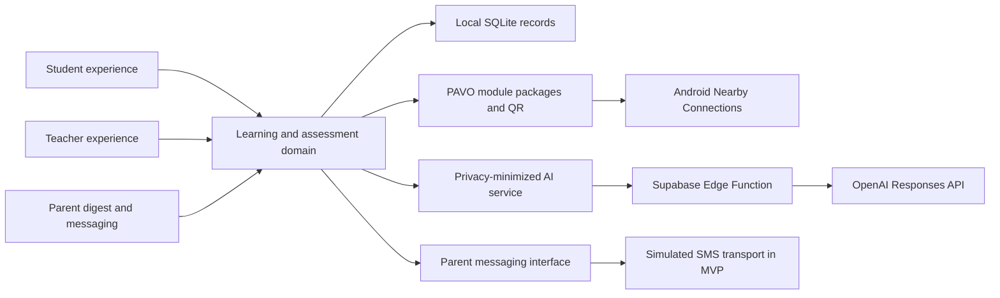

# PAVO

**Personalized Adaptive Virtual Organizer**

PAVO is an Android-first learning and classroom intelligence platform built for
Filipino students, teachers, and parents. It keeps core learning available
offline, adapts practice to each learner, gives teachers actionable class
signals, and turns progress into clear family communication.

The active application is the Expo React Native project in
[`mobile`](./mobile). The bundled lessons are original, MATATAG-aligned demo
materials and are not official Department of Education curriculum text.

## Product Description

Many Philippine classrooms face two problems at once: learners do not always
have reliable internet access, and teachers do not have enough time or data to
personalize support for every student. Existing cloud-only learning platforms
can stop working exactly where support is most needed.

PAVO creates a continuous learning loop:

1. **Students learn offline.** Grade-specific modules, visual aids, read-aloud
   lessons, quizzes, flashcards, and study tools live on the device.
2. **PAVO adapts.** Quiz accuracy, timing, missed concepts, learning format, and
   review history shape the next activity and Study Jam.
3. **Teachers act.** Class dashboards, section leaderboards, learner reports,
   AI-supported intervention plans, and content authoring turn records into
   practical teaching decisions.
4. **Families stay informed.** Parent-protected weekly digests explain progress,
   while a teacher-facing SMS composer demonstrates direct parent updates.

PAVO supports **UN Sustainable Development Goal 4: Quality Education** by
reducing connectivity barriers, supporting differentiated instruction, and
making learner progress understandable to the adults helping the child.

## MVP At A Glance

- 180 offline modules across Grades 1-10 in Science, Mathematics, and English
- 360 bundled WebP diagrams and teaching aids
- Multiple-choice, fill-in-the-blank, and identification quizzes
- Detailed attempt logs with responses, timing, learning format, strengths,
  gaps, mastery, and retake history
- Pavo student AI partner with persistent local conversations and generated
  Study Jams grounded in vetted modules
- Adaptive lesson formats: text, audio, visual, and kinesthetic
- Active recall, SM-2 spaced repetition, interleaving, and Pomodoro sessions
- Online and offline weekly learning digests
- Teacher sections, roster scanning, assignments, leaderboards, record book,
  class insights, and individual intervention plans
- Gurobot authoring for lesson plans, modules, reviewers, and standalone quizzes
- Shared interactive previews, PDF lesson-plan export, QR exchange, and Android
  Nearby Connections transfer
- Parent name and mobile number in student setup and profile QR
- Teacher-to-parent SMS composer with validation, character count, recipient
  confirmation, and simulated delivery

### Offline assessment revamp

- Teachers choose **paper OMR** or a **digital mini-quiz** first, then author
  shared questions with a competency, misconception, and intervention for each.
- **Paper quizzes:**
  - PAVO prints original question papers and bubble answer sheets, with
    alternate forms.
  - The teacher's phone scans them offline with OpenCV.
  - Unclear marks always go to teacher review, and every correction is
    audited.
- **Digital mini-quizzes:**
  - The quiz runs offline and resumes if interrupted.
  - The result returns to the teacher as one compact `PAVO_RESULT_V1` QR code
    that lists failed and unanswered questions only.
- **Teacher web studio** (`web/`): writes lessons and quizzes and exports
  `module.pdf`, `adaptive-lesson.md`, `assessment-guide.md`, a manifest, and
  student and teacher packages.
- **SHAREit-style Nearby transfer:** the receiver must approve, interrupted
  transfers resume, delivery is confirmed with receipts, and student sharing
  respects the package's redistribution rules.
- **Adaptive lessons:** hints, knowledge checks, and steps the app reorders
  from the learner's results, each with a visible "Why?" explanation.
- **External content providers:** an offline demo library, plus a link-only
  Khan Academy adapter that is off by default. PAVO has no Khan Academy
  partnership.

See [docs/ARCHITECTURE.md](docs/ARCHITECTURE.md) for the schemas, OMR
confidence rules, the QR format, and the transfer protocol.

> **Demo boundary:** the SMS flow is intentionally simulated. It never contacts
> a real phone number. The transport is isolated behind a service interface so
> a production SMS provider can replace the demo implementation later.

## Judging Criteria Alignment

| Category | Weight | PAVO evidence |
| --- | ---: | --- |
| Relevance and Focus Alignment | 10% | Directly advances SDG 4 through offline access, personalized practice, teacher decision support, and family visibility. |
| Impact Framing | 15% | Designed for uneven connectivity and constrained classroom resources in the Philippines; the offline core remains useful without subscriptions or continuous data. |
| Problem-Solution Fit | 15% | Addresses validated classroom friction: inaccessible cloud content, one-size-fits-all practice, fragmented learner records, teacher workload, and weak home-school feedback loops. |
| Functionality | 15% | The Android MVP implements student learning, quizzes, adaptive records, teacher dashboards, AI tools, QR exchange, content transfer, parent digests, and the complete demo messaging interaction. |
| User Experience | 10% | Role-based navigation, large touch targets, clear progress states, accessible labels, restrained visual hierarchy, grade-aware onboarding, and offline status cues serve students and teachers directly. |
| Completeness | 10% | Automated tests cover domain and privacy behavior; seed validation checks every module; Expo Doctor and native Android builds verify the demonstration path. Known demo limits are disclosed below. |
| System Design | 8% | Domain logic, repositories, SQLite persistence, services, screens, native Nearby transfer, and Supabase Edge Functions are modular boundaries that can be upgraded independently. |
| Technical Depth | 4% | Local analytics, detailed assessment telemetry, spaced repetition, adaptive format confidence, QR schemas, archive integrity checks, privacy-safe AI payloads, and offline/online fallbacks form measurable feedback loops. |
| Innovation | 8% | PAVO combines offline-first curriculum delivery with optional grounded AI, device-to-device classroom exchange, adaptive study formats, teacher content generation, and parent communication in one Android client. |
| Adherence to Guidelines | 5% | The repository includes reproducible run and validation commands, explicit demo boundaries, original learning content notices, and a scoped Android MVP. |

## Impact And Sustainability

PAVO is more than a temporary connectivity workaround. Its long-term model is
to keep the essential learning experience local while treating internet access
as an enhancement:

- A learner can read, listen, practise, review, and inspect progress offline.
- Teachers can exchange signed, bounded module packages directly between
  Android devices.
- Cloud AI receives minimized academic context rather than names, phone
  numbers, raw local histories, or authentication data.
- Static curriculum packages can be updated independently of the interface.
- The PAVO module format and Nearby transport can support school-created content
  without requiring each learner to maintain a cloud account.

This architecture lowers recurring bandwidth dependence and leaves a practical
upgrade path for school synchronization, production SMS delivery, and
district-level curriculum distribution.

## System Design



### Main Boundaries

- `mobile/src/domain` - schemas, assessment, adaptation, reporting, and privacy
- `mobile/src/data` - SQLite migrations, repositories, and demo fixtures
- `mobile/src/services` - AI, messaging, connectivity, transfer, files, and
  package orchestration
- `mobile/src/screens` - student, teacher, parent-review, and transfer workflows
- `mobile/modules/pavo-nearby/android` - native Nearby Connections transport
  and foreground transfer service
- `mobile/modules/pavo-omr` - Kotlin + OpenCV answer-sheet scanner
- `web` - Teacher Studio for authoring and export (shares `mobile/src/domain`)
- `mobile/supabase/functions/pavo-companion` - child-safe AI gateway
- `mobile/seed` - static MATATAG-aligned lesson sources and `.pavo-module`
  archives

## Privacy And Safety

- Core learner data remains on the Android device.
- Parent contact details are carried only in the student profile flow and are
  not included in AI requests.
- Teacher AI insight requests use anonymized academic aggregates.
- Student AI output is moderated and grounded in selected local modules.
- Parent-facing changes and weekly digests use a local parent PIN.
- Transfer archives are schema-validated, size-bounded, and checksum-verified.
- The demo SMS service performs no network request.

## Demonstration Path

1. Open **Explore a demo classroom**.
2. Inspect the student dashboard, module library, quiz history, Study Jams, and
   Pavo AI partner.
3. Sign out, choose **Teacher**, and use faculty ID `T-2026`.
4. Open the record book and select a learner.
5. Generate an AI approach plan, then compose and send a demo SMS to the listed
   parent.
6. Open Gurobot to create a lesson plan, module, quiz, reviewer, or class
   summary.
7. Review section leaderboards and online/offline weekly learning evidence.

Offline assessment walkthrough (about 5 minutes; both apps ship with matching
demo content, so nothing has to be typed):

1. **Web studio.** In `web`, run `npm run dev` and choose **Explore the demo
   library**. Three Grade 5 packages load:
   - *How plants make food* (digital mini-quiz, exported)
   - *Adding dissimilar fractions* (paper quiz with forms A and B, published)
   - *Subject–verb agreement* (lesson-only draft)
2. **Show the lesson.** Open **Preview** and step through the lesson in the
   phone frame, including the hints and the knowledge check.
3. **Export.** On **Export**, build the bundle and walk through what goes to
   students, what stays with the teacher, and what gets printed.
4. **Student phone.** On Android, **Explore a demo classroom** signs in as
   Maria. Under **Modules → From your teacher**, open the plants lesson, then take
   *Plants make food: mini-quiz* and show the result QR.
5. **Teacher phone.** Sign out and continue as teacher (`T-2026`). **Quizzes**
   already holds both assessments with a class set of results:
   - The paper quiz shows score distribution, competencies, and likely
     misconceptions, with stats for each form.
   - **Scan student result** imports Maria's QR live.
6. **Paper mode.** Print a form from the paper quiz and grade it with
   **Scan answer sheets**.

## Known MVP Limits

- SMS delivery is simulated and clearly labelled; no telecom provider is
  connected.
- AI features require internet access and configured Supabase/OpenAI services;
  all core lessons and study records continue offline.
- Nearby transfer and paper scanning have **not** yet been acceptance-tested on
  physical devices. Emulators cannot validate radio transfer, throughput, or
  camera scanning.
- The OMR thresholds were tuned on synthetic fixtures only. Real paper, pens,
  and cameras may need adjustment.
- A result QR is only *authentic* when it is signed by a device key the
  teacher enrolled. The checksum only catches damaged scans.
- Offline self-scoring stores salted answer digests on the student phone. This
  stops casual inspection, not a determined student. Use paper mode for
  high-stakes tests.
- No improvement in learning outcomes has been measured yet.
- The repository is Android-first. iOS development is outside the current MVP
  scope.

## Run The Android App

```bash
cd mobile
npm install
JAVA_HOME="/Applications/Android Studio.app/Contents/jbr/Contents/Home" npm run android
```

PAVO uses a custom Android Nearby module and therefore requires a development
build rather than Expo Go.

## Validate

```bash
cd mobile
npm run seed:validate
npm run validate
npx expo-doctor
cd android
./gradlew :app:assembleDebug
```

Teacher Studio:

```bash
cd web
npm install
npm run dev
npm test
npm run build
```

## Repository

[github.com/DrewBasadre/Jeymi-and-Friends](https://github.com/DrewBasadre/Jeymi-and-Friends)
