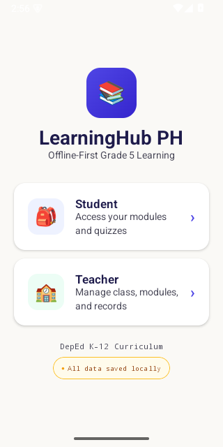

# WAIS

WAIS is an offline-first Android learning hub for Grade 5 classrooms. It gives
students a local module reader, quizzes, progress tracking, and QR-based sharing
while giving teachers a class dashboard, record book, QR scanner, and AI-assisted
lesson support through Gurobot.



## What The App Can Do

- Let students sign in with a student number or last name plus PIN.
- Show student dashboards with completion, average score, attempts, weak topics,
  and strong topics.
- Present Grade 5 Science, Math, and English modules with lesson content,
  subject filters, read tracking, quiz access, best scores, and completion
  states.
- Limit quiz attempts to two per module and keep the best attempt as the final
  result.
- Generate student profile, quiz result, and progress QR payloads for offline
  transfer between student and teacher devices.
- Scan or upload QR images with CameraX, ML Kit barcode scanning, and ZXing.
- Let teachers import student profiles, quiz results, and progress exports into
  the local record book.
- Show teacher dashboards with class averages, top learners, learners needing
  intervention, individual performance details, and scanned quiz evidence.
- Generate low-resource lesson drafts and teacher action suggestions with
  Gemini when a `GEMINI_API_KEY` is configured.
- Fall back to offline lesson drafts and assessment suggestions when Gemini is
  unavailable.
- Save generated teacher lessons into the student-visible module library and
  share them as QR payloads or text files.
- Ingest text-like curriculum sources through the curriculum services for
  grounded lesson and quiz generation experiments.

## Tech Stack

- Kotlin, Jetpack Compose, Material 3
- Room with exported schemas and migrations through database version 3
- Kotlin coroutines and flows
- CameraX, ML Kit Barcode Scanning, ZXing
- kotlinx.serialization
- Gemini REST calls through `HttpURLConnection`
- Gradle Kotlin DSL, Android Gradle Plugin 8.7.3, Kotlin 2.2.21

## Getting Started

1. Install Android Studio or an Android SDK with JDK 17 available.
2. Copy `local.properties.example` to `local.properties`.
3. Set your local SDK path in `local.properties`.
4. Optionally set `GEMINI_API_KEY` in `local.properties`, as a Gradle property,
   or as an environment variable.
5. Run the unit tests:

```sh
./gradlew testDebugUnitTest
```

6. Build a debug APK:

```sh
./gradlew assembleDebug
```

The debug APK is generated at `app/build/outputs/apk/debug/app-debug.apk`.

Build note: `assembleDebug` currently succeeds, but D8 may print Kotlin metadata
warnings with the current Android Gradle Plugin/R8 and Kotlin 2.2.x pairing.

## Demo Access

Teacher demo login:

- Teacher Number: `T-1001`
- Password: `teacher123`

Seeded student PINs:

- Ana Reyes: `1111`
- Ben Santos: `2222`
- Carla Dizon: `3333`
- Dan Cruz: `4444`
- Ella Garcia: `5555`
- Felix Lim: `6666`

Students imported from a scanned student profile QR receive the default teacher
import PIN `1234`.

## Repository Layout

- `app/src/main/java/com/pangarap/learninghub/ui` - Compose screens, theme, and
  view model state.
- `app/src/main/java/com/pangarap/learninghub/data` - Room entities, DAOs,
  migrations, seed data, and repositories.
- `app/src/main/java/com/pangarap/learninghub/ai` - Gurobot lesson and teaching
  action generation.
- `app/src/main/java/com/pangarap/learninghub/curriculum` - Curriculum
  ingestion, retrieval, grounded lesson plan generation, and quiz generation.
- `app/src/main/java/com/pangarap/learninghub/sync` - QR/export payload models.
- `app/schemas` - Versioned Room schemas.
- `documentation.md` - Product, architecture, and history documentation.
- `DESIGN.md` - Visual system and Compose implementation notes.
- `CHANGELOG.md` - Public-facing change history.

## Public Release Notes

`local.properties` is intentionally ignored because it can contain local SDK
paths and private API keys. The committed `local.properties.example` documents
the expected keys without storing secrets.

The current sign-in flow and seeded credentials are for local classroom demos and
prototype evaluation. Treat them as sample access control, not production
authentication.

No license has been declared yet. Add a license before distributing the project
as open source.
