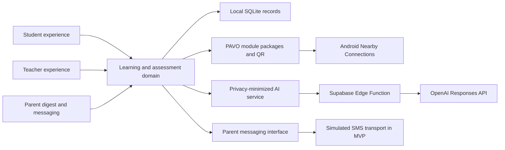

# PAVO

**Personalized Adaptive Virtual Organizer**

PAVO is an Android-first learning and classroom intelligence platform built for
Filipino students, teachers, and parents. It keeps core learning available
offline, adapts practice to each learner, gives teachers actionable class
signals, and turns progress into clear family communication.

The active application is the Expo React Native project in
[`mobile`](./mobile). The bundled lessons are original, MATATAG-aligned demo
materials and are not official Department of Education curriculum text.

## Product Description

Many Philippine classrooms face two problems at once: learners do not always
have reliable internet access, and teachers do not have enough time or data to
personalize support for every student. Existing cloud-only learning platforms
can stop working exactly where support is most needed.

PAVO creates a continuous learning loop:

1. **Students learn offline.** Grade-specific modules, visual aids, read-aloud
   lessons, quizzes, flashcards, and study tools live on the device.
2. **PAVO adapts.** Quiz accuracy, timing, missed concepts, learning format, and
   review history shape the next activity and Study Jam.
3. **Teachers act.** Class dashboards, section leaderboards, learner reports,
   AI-supported intervention plans, and content authoring turn records into
   practical teaching decisions.
4. **Families stay informed.** Parent-protected weekly digests explain progress,
   while a teacher-facing SMS composer demonstrates direct parent updates.

PAVO supports **UN Sustainable Development Goal 4: Quality Education** by
reducing connectivity barriers, supporting differentiated instruction, and
making learner progress understandable to the adults helping the child.

## MVP At A Glance

- 180 offline modules across Grades 1-10 in Science, Mathematics, and English
- 360 bundled WebP diagrams and teaching aids
- Multiple-choice, fill-in-the-blank, and identification quizzes
- Detailed attempt logs with responses, timing, learning format, strengths,
  gaps, mastery, and retake history
- Pavo student AI partner with persistent local conversations and generated
  Study Jams grounded in vetted modules
- Adaptive lesson formats: text, audio, visual, and kinesthetic
- Active recall, SM-2 spaced repetition, interleaving, and Pomodoro sessions
- Online and offline weekly learning digests
- Teacher sections, roster scanning, assignments, leaderboards, record book,
  class insights, and individual intervention plans
- Gurobot authoring for lesson plans, modules, reviewers, and standalone quizzes
- Shared interactive previews, PDF lesson-plan export, QR exchange, and Android
  Nearby Connections transfer
- Parent name and mobile number in student setup and profile QR
- Teacher-to-parent SMS composer with validation, character count, recipient
  confirmation, and simulated delivery

> **Demo boundary:** the SMS flow is intentionally simulated. It never contacts
> a real phone number. The transport is isolated behind a service interface so
> a production SMS provider can replace the demo implementation later.

## Judging Criteria Alignment

| Category | Weight | PAVO evidence |
| --- | ---: | --- |
| Relevance and Focus Alignment | 10% | Directly advances SDG 4 through offline access, personalized practice, teacher decision support, and family visibility. |
| Impact Framing | 15% | Designed for uneven connectivity and constrained classroom resources in the Philippines; the offline core remains useful without subscriptions or continuous data. |
| Problem-Solution Fit | 15% | Addresses validated classroom friction: inaccessible cloud content, one-size-fits-all practice, fragmented learner records, teacher workload, and weak home-school feedback loops. |
| Functionality | 15% | The Android MVP implements student learning, quizzes, adaptive records, teacher dashboards, AI tools, QR exchange, content transfer, parent digests, and the complete demo messaging interaction. |
| User Experience | 10% | Role-based navigation, large touch targets, clear progress states, accessible labels, restrained visual hierarchy, grade-aware onboarding, and offline status cues serve students and teachers directly. |
| Completeness | 10% | Automated tests cover domain and privacy behavior; seed validation checks every module; Expo Doctor and native Android builds verify the demonstration path. Known demo limits are disclosed below. |
| System Design | 8% | Domain logic, repositories, SQLite persistence, services, screens, native Nearby transfer, and Supabase Edge Functions are modular boundaries that can be upgraded independently. |
| Technical Depth | 4% | Local analytics, detailed assessment telemetry, spaced repetition, adaptive format confidence, QR schemas, archive integrity checks, privacy-safe AI payloads, and offline/online fallbacks form measurable feedback loops. |
| Innovation | 8% | PAVO combines offline-first curriculum delivery with optional grounded AI, device-to-device classroom exchange, adaptive study formats, teacher content generation, and parent communication in one Android client. |
| Adherence to Guidelines | 5% | The repository includes reproducible run and validation commands, explicit demo boundaries, original learning content notices, and a scoped Android MVP. |

## Impact And Sustainability

PAVO is more than a temporary connectivity workaround. Its long-term model is
to keep the essential learning experience local while treating internet access
as an enhancement:

- A learner can read, listen, practise, review, and inspect progress offline.
- Teachers can exchange signed, bounded module packages directly between
  Android devices.
- Cloud AI receives minimized academic context rather than names, phone
  numbers, raw local histories, or authentication data.
- Static curriculum packages can be updated independently of the interface.
- The PAVO module format and Nearby transport can support school-created content
  without requiring each learner to maintain a cloud account.

This architecture lowers recurring bandwidth dependence and leaves a practical
upgrade path for school synchronization, production SMS delivery, and
district-level curriculum distribution.

## System Design



### Main Boundaries

- `mobile/src/domain` - schemas, assessment, adaptation, reporting, and privacy
- `mobile/src/data` - SQLite migrations, repositories, and demo fixtures
- `mobile/src/services` - AI, messaging, connectivity, transfer, files, and
  package orchestration
- `mobile/src/screens` - student, teacher, parent-review, and transfer workflows
- `mobile/modules/pavo-nearby/android` - native Nearby Connections transport
- `mobile/supabase/functions/pavo-companion` - child-safe AI gateway
- `mobile/seed` - static MATATAG-aligned lesson sources and `.pavo-module`
  archives

## Privacy And Safety

- Core learner data remains on the Android device.
- Parent contact details are carried only in the student profile flow and are
  not included in AI requests.
- Teacher AI insight requests use anonymized academic aggregates.
- Student AI output is moderated and grounded in selected local modules.
- Parent-facing changes and weekly digests use a local parent PIN.
- Transfer archives are schema-validated, size-bounded, and checksum-verified.
- The demo SMS service performs no network request.

## Demonstration Path

1. Open **Explore a demo classroom**.
2. Inspect the student dashboard, module library, quiz history, Study Jams, and
   Pavo AI partner.
3. Sign out, choose **Teacher**, and use faculty ID `T-2026`.
4. Open the record book and select a learner.
5. Generate an AI approach plan, then compose and send a demo SMS to the listed
   parent.
6. Open Gurobot to create a lesson plan, module, quiz, reviewer, or class
   summary.
7. Review section leaderboards and online/offline weekly learning evidence.

## Known MVP Limits

- SMS delivery is simulated and clearly labelled; no telecom provider is
  connected.
- AI features require internet access and configured Supabase/OpenAI services;
  all core lessons and study records continue offline.
- Nearby transfer requires physical Android devices for final radio-level
  acceptance testing.
- Runs on **both iOS and Android** from one React Native codebase (verified on
  the iOS Simulator and an Android emulator at visual/functional parity).

## Tech Stack

| Layer | Technology |
| --- | --- |
| Framework | React Native 0.86 on Expo SDK 57 (prebuild), New Architecture + Hermes |
| Language | TypeScript (strict) |
| Navigation | React Navigation 7 (native-stack + bottom-tabs) |
| State | Zustand |
| Styling | React Native StyleSheet + centralized "Peacock" design tokens (no CSS/UI lib) |
| Graphics / animation | react-native-svg (gradients, rings, QR, pixel-art mascot) + RN Animated (typewriter, process steps) |
| Validation | Zod |
| Offline storage | expo-sqlite (offline-first, additive migrations) + AsyncStorage |
| Device features | expo-camera, expo-speech, expo-notifications, expo-print, expo-sharing, expo-document-picker, expo-network |
| Native module | `pavo-nearby` — device-to-device transfer via Google Nearby Connections (Swift on iOS, Kotlin on Android) |
| AI | Client service with Zod-validated structured responses + on-device demo fallback → Supabase Edge Function (`pavo-companion`, Deno) → OpenAI (key stays server-side) |
| Backend (optional) | Supabase — auth, Postgres, edge functions, migrations (the app is fully usable offline) |
| Tooling | Jest, `tsc`, Metro; Gradle 9 / JDK 17 (Android), Xcode (iOS) |

PAVO uses a custom Nearby native module, so it needs a **development build**
(not Expo Go).

## Getting Started

```bash
cd mobile
cp .env.example .env   # public config; the OpenAI key stays server-side
npm install
```

**iOS** (macOS + Xcode):

```bash
npm run ios
```

**Android** (JDK 17 + Android SDK + an emulator/AVD named `pavo`):

```bash
export ANDROID_HOME=$HOME/Library/Android/sdk   # or your SDK path
export JAVA_HOME=$(/usr/libexec/java_home -v 17)
npm run android
# or, to also boot the emulator window in one step:
bash run-android-emulator.sh
```

> First-time Android setup needs JDK 17, the Android SDK (platform 36,
> build-tools 36, an emulator system image), and an AVD. `run-android-emulator.sh`
> respects an existing `ANDROID_HOME`/`JAVA_HOME`.

The AI companion works **offline in demo mode** (answers simulated on-device).
For live answers, keep `EXPO_PUBLIC_PAVO_API_URL` set and deploy the
`pavo-companion` edge function with its server-side `OPENAI_API_KEY`.

## Validate

```bash
cd mobile
npm run seed:validate
npm run validate
npx expo-doctor
cd android
./gradlew :app:assembleDebug
```

## Repository

[github.com/DrewBasadre/Jeymi-and-Friends](https://github.com/DrewBasadre/Jeymi-and-Friends)
