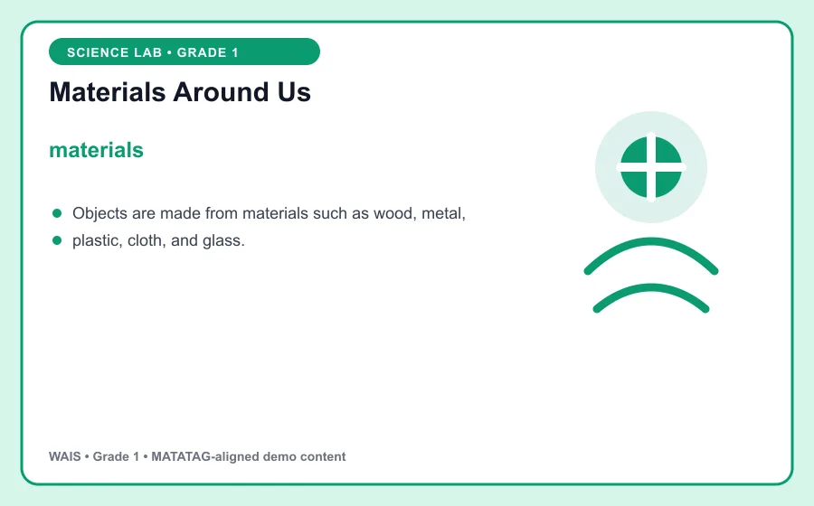
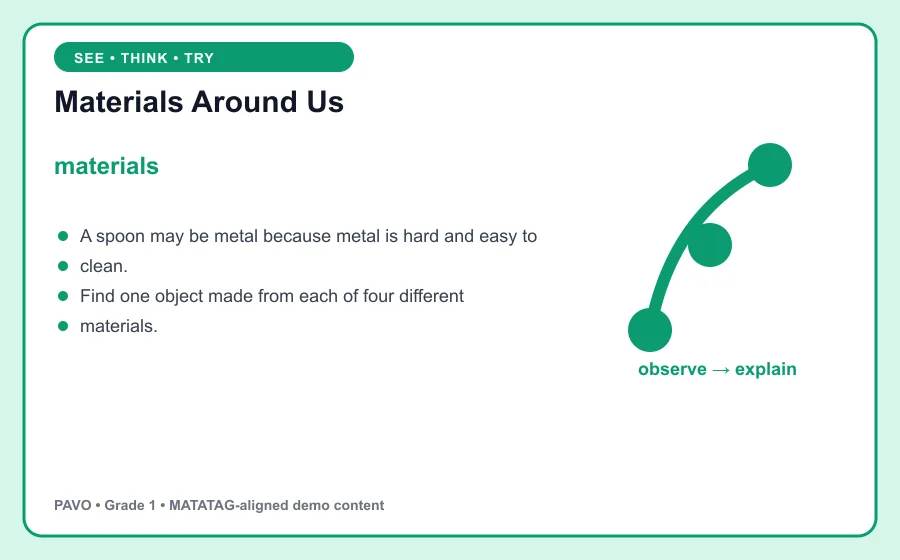

# Materials Around Us

> WAIS demo content aligned to MATATAG Quarter 1 learning goals. This is an original classroom learning aid, not official curriculum text.

## Learning goal

By the end of this lesson, you can explain **materials**, use it in a clear example, and apply the idea in a short task.

## Key idea

`materials` is the focus of this lesson. Objects are made from materials such as wood, metal, plastic, cloth, and glass.

Say the key words aloud. Point to the visual as you explain what you notice.

## Worked example

A spoon may be metal because metal is hard and easy to clean.

Notice how the example supports the key idea instead of simply naming it. Ask: What changed? What stayed the same?

## Guided practice

1. Restate the key idea in your own words.
2. Identify the important information in the worked example.
3. Complete this task: Find one object made from each of four different materials.
4. Check your answer by returning to the definition and visual.

## Talk and think

- What detail was most useful?
- What is one common mistake someone might make?
- Where could you observe or use this idea at home, in school, or in the community?

## Remember

The goal is not only to memorize **materials**. You should be able to recognize it, explain it, and use it in a new situation.
