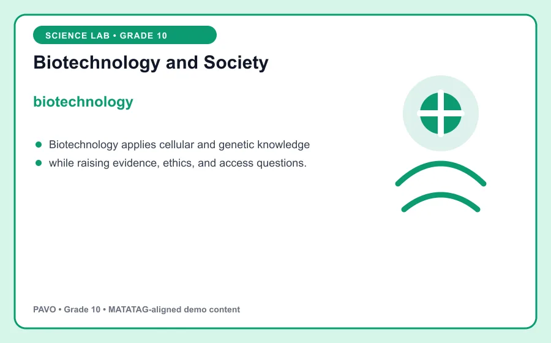
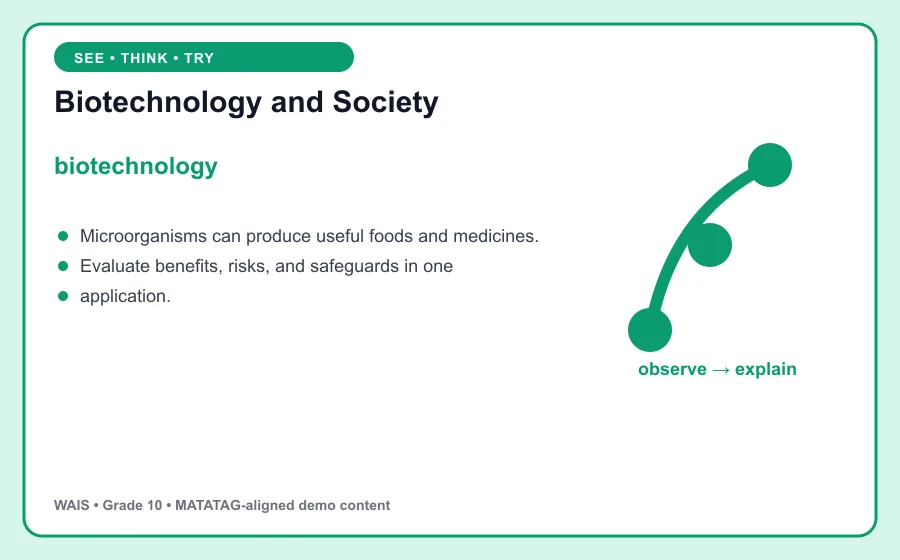

# Biotechnology and Society

> WAIS demo content aligned to MATATAG Quarter 1 learning goals. This is an original classroom learning aid, not official curriculum text.

## Learning goal

By the end of this lesson, you can explain **biotechnology**, use it in a clear example, and apply the idea in a short task.

## Key idea

`biotechnology` is the focus of this lesson. Biotechnology applies cellular and genetic knowledge while raising evidence, ethics, and access questions.

Use evidence from the model to explain the relationship, limitation, or pattern you observe.

## Worked example

Microorganisms can produce useful foods and medicines.

Notice how the example supports the key idea instead of simply naming it. Ask: What assumptions does the model make, and what evidence would strengthen the conclusion?

## Guided practice

1. Restate the key idea in your own words.
2. Identify the important information in the worked example.
3. Complete this task: Evaluate benefits, risks, and safeguards in one application.
4. Check your answer by returning to the definition and visual.

## Talk and think

- What detail was most useful?
- What is one common mistake someone might make?
- Where could you observe or use this idea at home, in school, or in the community?

## Remember

The goal is not only to memorize **biotechnology**. You should be able to recognize it, explain it, and use it in a new situation.
