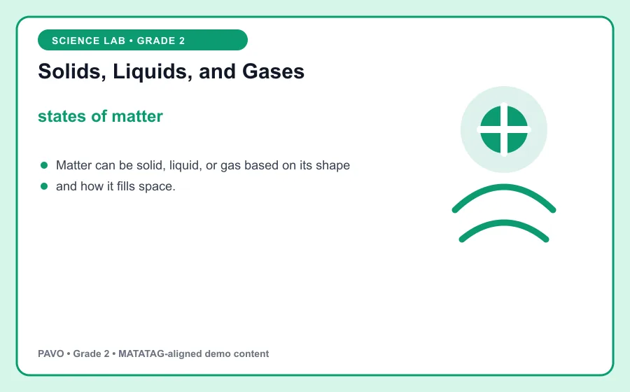
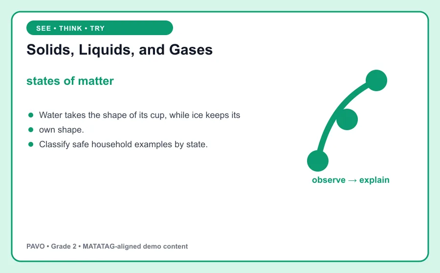

# Solids, Liquids, and Gases

> PAVO demo content aligned to MATATAG Quarter 1 learning goals. This is an original classroom learning aid, not official curriculum text.

## Learning goal

By the end of this lesson, you can explain **states of matter**, use it in a clear example, and apply the idea in a short task.

## Key idea

`states of matter` is the focus of this lesson. Matter can be solid, liquid, or gas based on its shape and how it fills space.

Say the key words aloud. Point to the visual as you explain what you notice.

## Worked example

Water takes the shape of its cup, while ice keeps its own shape.

Notice how the example supports the key idea instead of simply naming it. Ask: What changed? What stayed the same?

## Guided practice

1. Restate the key idea in your own words.
2. Identify the important information in the worked example.
3. Complete this task: Classify safe household examples by state.
4. Check your answer by returning to the definition and visual.

## Talk and think

- What detail was most useful?
- What is one common mistake someone might make?
- Where could you observe or use this idea at home, in school, or in the community?

## Remember

The goal is not only to memorize **states of matter**. You should be able to recognize it, explain it, and use it in a new situation.
