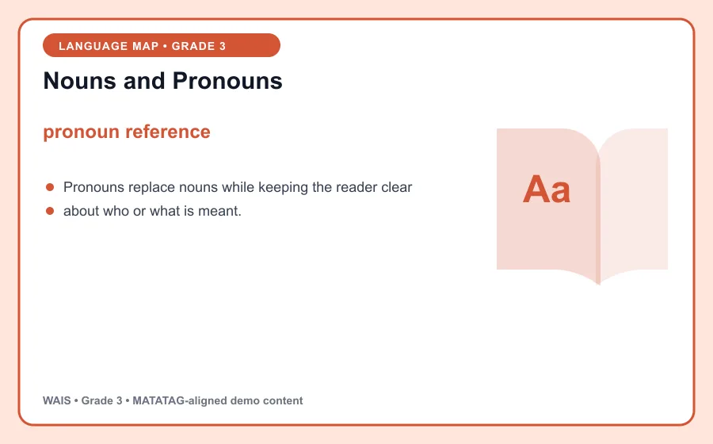
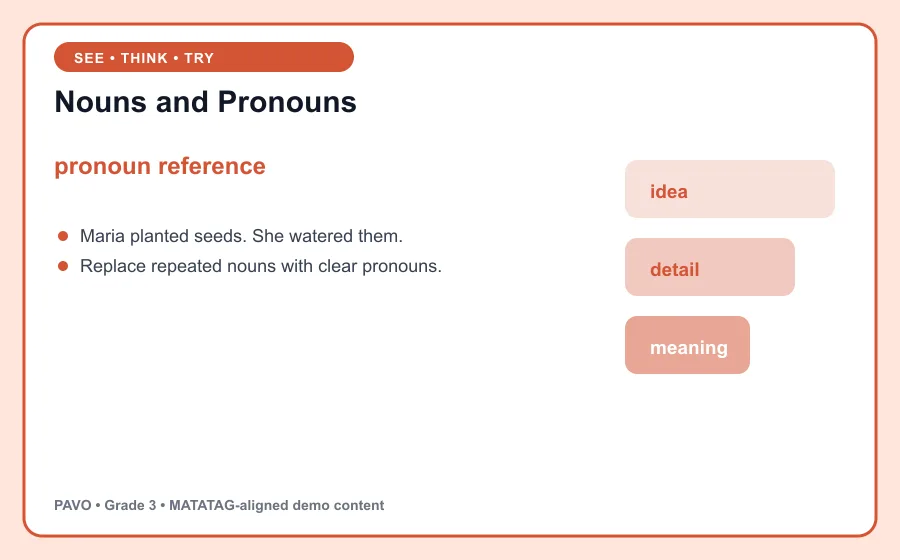

# Nouns and Pronouns

> PAVO demo content aligned to MATATAG Quarter 1 learning goals. This is an original classroom learning aid, not official curriculum text.

## Learning goal

By the end of this lesson, you can explain **pronoun reference**, use it in a clear example, and apply the idea in a short task.

## Key idea

`pronoun reference` is the focus of this lesson. Pronouns replace nouns while keeping the reader clear about who or what is meant.

Connect the example to the key idea, then explain the connection in your own words.

## Worked example

Maria planted seeds. She watered them.

Notice how the example supports the key idea instead of simply naming it. Ask: What changed? What stayed the same?

## Guided practice

1. Restate the key idea in your own words.
2. Identify the important information in the worked example.
3. Complete this task: Replace repeated nouns with clear pronouns.
4. Check your answer by returning to the definition and visual.

## Talk and think

- What detail was most useful?
- What is one common mistake someone might make?
- Where could you observe or use this idea at home, in school, or in the community?

## Remember

The goal is not only to memorize **pronoun reference**. You should be able to recognize it, explain it, and use it in a new situation.
