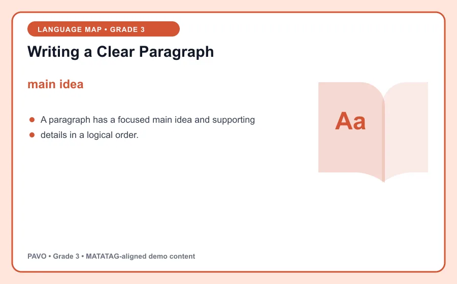
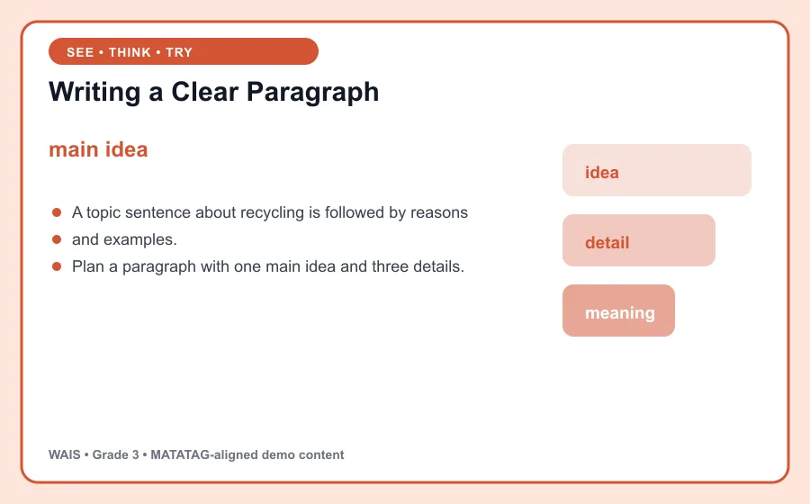

# Writing a Clear Paragraph

> PAVO demo content aligned to MATATAG Quarter 1 learning goals. This is an original classroom learning aid, not official curriculum text.

## Learning goal

By the end of this lesson, you can explain **main idea**, use it in a clear example, and apply the idea in a short task.

## Key idea

`main idea` is the focus of this lesson. A paragraph has a focused main idea and supporting details in a logical order.

Connect the example to the key idea, then explain the connection in your own words.

## Worked example

A topic sentence about recycling is followed by reasons and examples.

Notice how the example supports the key idea instead of simply naming it. Ask: What changed? What stayed the same?

## Guided practice

1. Restate the key idea in your own words.
2. Identify the important information in the worked example.
3. Complete this task: Plan a paragraph with one main idea and three details.
4. Check your answer by returning to the definition and visual.

## Talk and think

- What detail was most useful?
- What is one common mistake someone might make?
- Where could you observe or use this idea at home, in school, or in the community?

## Remember

The goal is not only to memorize **main idea**. You should be able to recognize it, explain it, and use it in a new situation.
