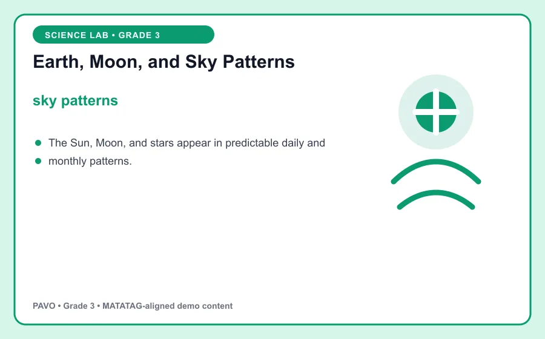
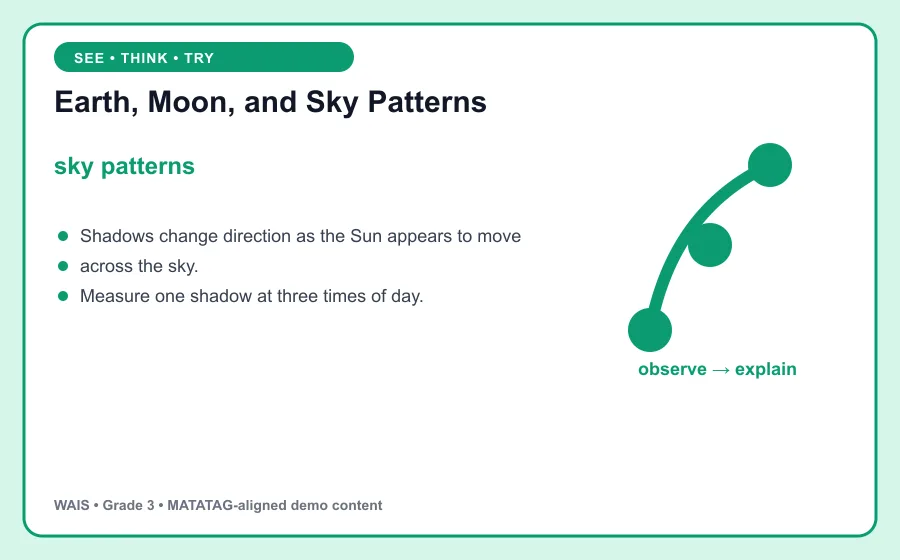

# Earth, Moon, and Sky Patterns

> PAVO demo content aligned to MATATAG Quarter 1 learning goals. This is an original classroom learning aid, not official curriculum text.

## Learning goal

By the end of this lesson, you can explain **sky patterns**, use it in a clear example, and apply the idea in a short task.

## Key idea

`sky patterns` is the focus of this lesson. The Sun, Moon, and stars appear in predictable daily and monthly patterns.

Connect the example to the key idea, then explain the connection in your own words.

## Worked example

Shadows change direction as the Sun appears to move across the sky.

Notice how the example supports the key idea instead of simply naming it. Ask: What changed? What stayed the same?

## Guided practice

1. Restate the key idea in your own words.
2. Identify the important information in the worked example.
3. Complete this task: Measure one shadow at three times of day.
4. Check your answer by returning to the definition and visual.

## Talk and think

- What detail was most useful?
- What is one common mistake someone might make?
- Where could you observe or use this idea at home, in school, or in the community?

## Remember

The goal is not only to memorize **sky patterns**. You should be able to recognize it, explain it, and use it in a new situation.
