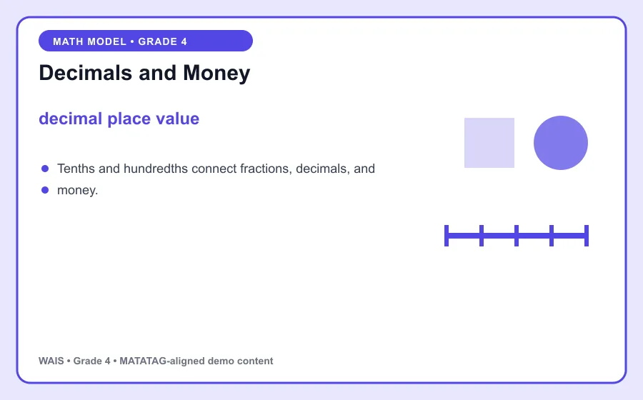
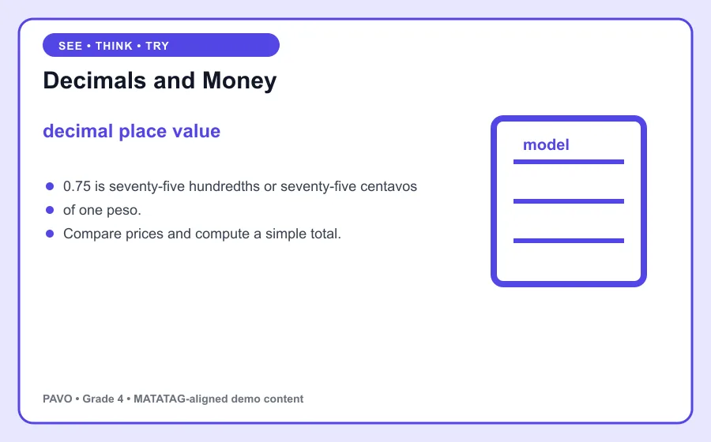

# Decimals and Money

> WAIS demo content aligned to MATATAG Quarter 1 learning goals. This is an original classroom learning aid, not official curriculum text.

## Learning goal

By the end of this lesson, you can explain **decimal place value**, use it in a clear example, and apply the idea in a short task.

## Key idea

`decimal place value` is the focus of this lesson. Tenths and hundredths connect fractions, decimals, and money.

Connect the example to the key idea, then explain the connection in your own words.

## Worked example

0.75 is seventy-five hundredths or seventy-five centavos of one peso.

Notice how the example supports the key idea instead of simply naming it. Ask: Which detail is evidence for the main idea, and how do you know?

## Guided practice

1. Restate the key idea in your own words.
2. Identify the important information in the worked example.
3. Complete this task: Compare prices and compute a simple total.
4. Check your answer by returning to the definition and visual.

## Talk and think

- What detail was most useful?
- What is one common mistake someone might make?
- Where could you observe or use this idea at home, in school, or in the community?

## Remember

The goal is not only to memorize **decimal place value**. You should be able to recognize it, explain it, and use it in a new situation.
