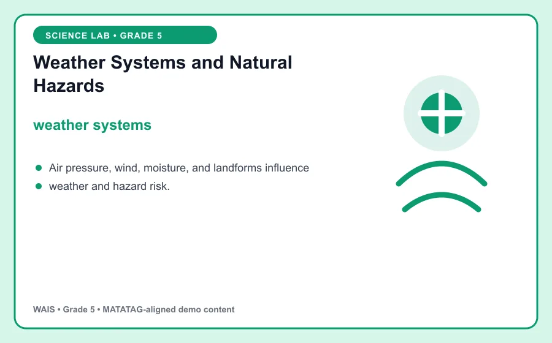
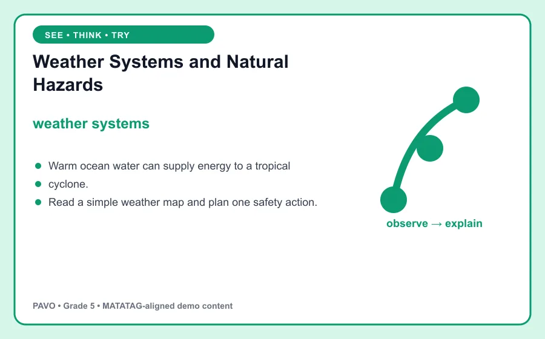

# Weather Systems and Natural Hazards

> WAIS demo content aligned to MATATAG Quarter 1 learning goals. This is an original classroom learning aid, not official curriculum text.

## Learning goal

By the end of this lesson, you can explain **weather systems**, use it in a clear example, and apply the idea in a short task.

## Key idea

`weather systems` is the focus of this lesson. Air pressure, wind, moisture, and landforms influence weather and hazard risk.

Connect the example to the key idea, then explain the connection in your own words.

## Worked example

Warm ocean water can supply energy to a tropical cyclone.

Notice how the example supports the key idea instead of simply naming it. Ask: Which detail is evidence for the main idea, and how do you know?

## Guided practice

1. Restate the key idea in your own words.
2. Identify the important information in the worked example.
3. Complete this task: Read a simple weather map and plan one safety action.
4. Check your answer by returning to the definition and visual.

## Talk and think

- What detail was most useful?
- What is one common mistake someone might make?
- Where could you observe or use this idea at home, in school, or in the community?

## Remember

The goal is not only to memorize **weather systems**. You should be able to recognize it, explain it, and use it in a new situation.
