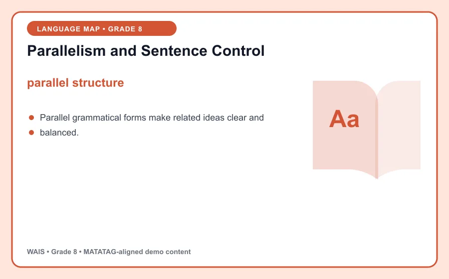
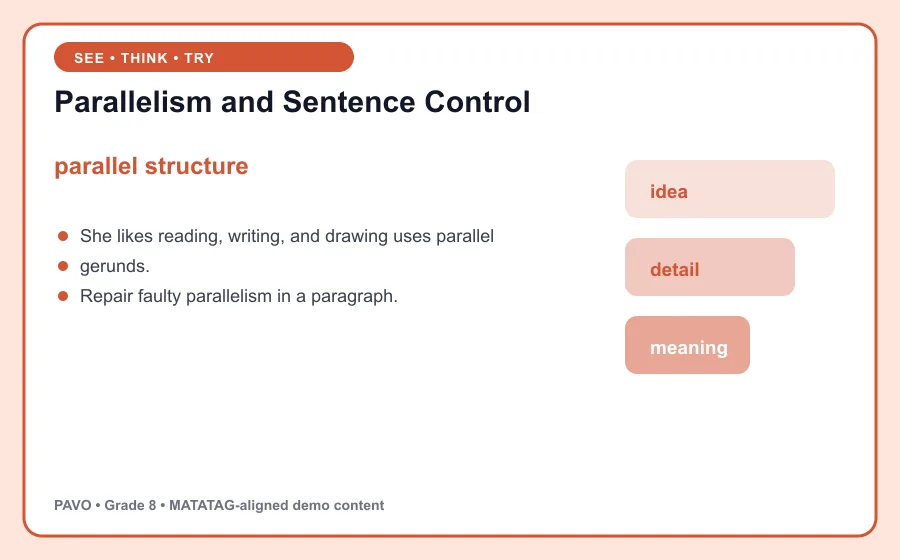

# Parallelism and Sentence Control

> WAIS demo content aligned to MATATAG Quarter 1 learning goals. This is an original classroom learning aid, not official curriculum text.

## Learning goal

By the end of this lesson, you can explain **parallel structure**, use it in a clear example, and apply the idea in a short task.

## Key idea

`parallel structure` is the focus of this lesson. Parallel grammatical forms make related ideas clear and balanced.

Use evidence from the model to explain the relationship, limitation, or pattern you observe.

## Worked example

She likes reading, writing, and drawing uses parallel gerunds.

Notice how the example supports the key idea instead of simply naming it. Ask: What assumptions does the model make, and what evidence would strengthen the conclusion?

## Guided practice

1. Restate the key idea in your own words.
2. Identify the important information in the worked example.
3. Complete this task: Repair faulty parallelism in a paragraph.
4. Check your answer by returning to the definition and visual.

## Talk and think

- What detail was most useful?
- What is one common mistake someone might make?
- Where could you observe or use this idea at home, in school, or in the community?

## Remember

The goal is not only to memorize **parallel structure**. You should be able to recognize it, explain it, and use it in a new situation.
