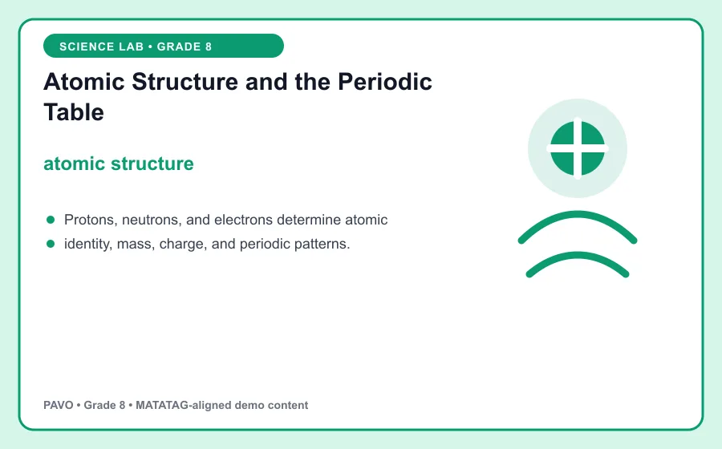
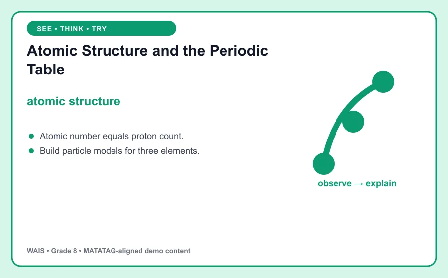

# Atomic Structure and the Periodic Table

> WAIS demo content aligned to MATATAG Quarter 1 learning goals. This is an original classroom learning aid, not official curriculum text.

## Learning goal

By the end of this lesson, you can explain **atomic structure**, use it in a clear example, and apply the idea in a short task.

## Key idea

`atomic structure` is the focus of this lesson. Protons, neutrons, and electrons determine atomic identity, mass, charge, and periodic patterns.

Use evidence from the model to explain the relationship, limitation, or pattern you observe.

## Worked example

Atomic number equals proton count.

Notice how the example supports the key idea instead of simply naming it. Ask: What assumptions does the model make, and what evidence would strengthen the conclusion?

## Guided practice

1. Restate the key idea in your own words.
2. Identify the important information in the worked example.
3. Complete this task: Build particle models for three elements.
4. Check your answer by returning to the definition and visual.

## Talk and think

- What detail was most useful?
- What is one common mistake someone might make?
- Where could you observe or use this idea at home, in school, or in the community?

## Remember

The goal is not only to memorize **atomic structure**. You should be able to recognize it, explain it, and use it in a new situation.
